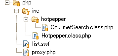
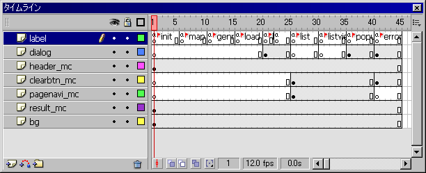
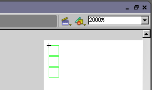
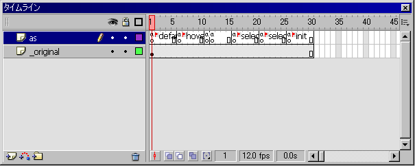

# FlashLite 1.1 と Hotpepper API との連携

携帯電話でのFlashの利用事例で、先ず思いつくのが各キャリアのトップページです。動きのあるインタラクティブなメニューは、皆さん、毎日目にしているのではないかと思います。一方、公式サイト、勝手サイトを問わず、その他の一般サイトに目を向けると、Flashで動きのあるバナーを制作するということは多いものの、モバイルサイトで全面的にFlashを採用した事例は少ないように思われます。

理由としては、PC版Flashでできるのにモバイル版Flash（Flash Lite）ではできないといった制約の多さにあります。と、同時に「制約が多いらしいね」という先入観で、モバイル版Flashの利用を躊躇されてい方も多いのではないかと思います。そこで、本チュートリアルでは、先ず最初に、モバイル版Flashの制約を解説し、何ができて何ができないかを整理します。その後、いくつかの制約の解決方法しながら、モバイル版Flashでもこんな実用的なアプリケーションが作れますよ！、ということを例示したいと思います。

なお、本チュートリアルで対象にしたFlashLiteのバージョンは2007年11月現在での普及版1.1です（本文中で特に指定が無ければバージョン1.1を指します）。新しいバージョン2.0では、また事情が異なる（制約が緩和される）点はご承知おきください。

「制約が多いらしいね」から「意外にいろいろできるね」へ、みなさんの認識が変わる一助になればと思います

## <a name="section1"></a> 1. FlashLite の制約

PC版Flashでできて、Flash Liteでできないという制約が幾つかあります。以下では、アプリケーションの実装において課題になると思われる制約事項についてまとめてあります。

* **インラインモード（HTMLに埋め込み）での、on（イベント）の取得ができません**

  インラインモード（HTMLに埋め込み）のswf では、エンターキーを含めすべてのキーイベントを受け取ることができません。インラインモードはFlashバナーで使われますが、リンクの設定はHTMLの側、つまり swf 全体を `<a>` タグで囲むことで行います。

* **`loadVariables` / `loadMovie` は 1クリックにつき1回しか呼び出せません**

  loadVariablesで読み込んだ変数でJPEG画像のURLを組立て、LoadMovieでそのJPEG画像読み込むということはできません

* **`loadVariables` / `loadMovie` は必ず `on(イベント)` で呼び出さないといけません**

* **PC版のように、FlashVarsや、URL引数を使って、`_root` に変数を渡すことはできません**

  これは、インライン再生・インタラクティブ再生共にできません

* **DoCoMo端末では、100KBの制限があります**

  DoCoMo端末では、`loadVariables` / `loadMovie`で読み込んだデータが、現在読み込んでいるSWFファイルのサイズに加算され、最大許容量100KBを超えると、以降の処理ができなくなります

* **XMLの読み込みとパースができません**

  Flash Lite 2.0からはできるようになります。

など、いろいろ不便なことがあります。

## 2. APIにアクセスする2つの方法

[1. Flash Lite の制約][section1]で述べたとおり、Flash Lite 1.1ではXMLの読み込みとパースができません
よって、Webサービス（通常、HotPepper APIのように結果はXMLで返ってきます）を直接呼び出すことができません。
これを解決する方法として次の2つの方法があります。

1. PHPやPerl等で作成したサーバアプリケーションが、Webサービスと携帯電話上のswfを仲介し、データ形式を適宜変換する。
2. [PHP Turbine] や [LibSWF]、[ming] などを使用して、Webサービスから得られたデータや画像をもとに、サーバーアプリケーションが動的にSWFファイルを生成し携帯電話に渡す。

今回は1つめの、サーバアプリケーションが、Webサービスと携帯電話上のswfを仲介する方法を使って、HotPepperAPIで得られる情報を携帯電話上で表示するアプリケーションを作成してみました。


実際に動作するものはこちらから（PC非対応。携帯電話でアクセスしてください。なおキャリア、機種によっては動作しない場合がありますのでご了承下さい。）

## 3. プロキシの仕組みと実装

### SWF から Web サービスへのアクセスの流れ

Webサービスと携帯電話上のswfを仲介する、PHPで作成したサーバアプリケーションを以下ではPHPプロキシと呼びます。


* SWF内部でPHPプロキシへの検索クエリを組み立て、リクエスト
* PHPプロキシが短縮パラメータを、[HotPepper API 本来のパラメータ][APIREF]に変換し、HotPepper APIにアクセス
* PHPプロキシがHotPepper APIのレスポンスを受け取り、`&` (アンパサンド)区切りの文字列にして、text/plainで出力
* SWFがPHPプロキシより `&` (アンパサンド)区切りの文字列を受け取る。

### PHPプロキシの構成



携帯電話上のswf用に短縮パラメータの処理や、XMLから（アンパサンド）区切り文字列への変換処理を行っているのは、PHPプロキシ本体の [proxy.php] です。

HotPepperAPIへのアクセスは `GourmetSearch` クラス ([GourmetSearch.class.php]) で行います。

今回はHotPepper APIのうち、グルメサーチAPIだけを使用しますが、HotPepperAPIのほか のAPIも利用できるよう、汎用の関数をもった [Hotpepper.class.php] を作成し、それを継承させて各API用のクラス (例えば、[GourmetSearch.class.php]) を作成しています。

[Hotpepper.class.php]、[GourmetSearch.class.php]、いずれも、モバイルアプリケーション、PC アプリケーション問わず汎用的に使えます。

### [proxy.php]

プロキシ本体

proxy.phpの、`$alias` オブジェクトに、モバイルアプリケーション用の短縮パラメータを記述します。

`"短縮パラメータ" => "HotPepper APIのパラメータ"` という記述です。

今回のサンプルでは使わないパラメータがほとんどですが、[リファレンス][APIREF]に載っているパラメータすべてに対応してあります。

GourmetSearchクラスにも、不正パラメータのエラーチェックがありますが、短縮パラメータでも同じ処理をしています。

Hotpepperクラスにある、userIsMobileという関数で、ユーザーはPCかモバイルかを判断し、モバイルの場合、Content-typeをtext/plainに設定します。

GourmetSearchクラスは、コンストラクタでAPIにアクセスします。newを使って、オブジェクトを生成した時点で、

```
$shops   店舗一覧
$total   総件数
$count   1ページあたりに表示する件数
$current 現在の結果表示開始数
$results 検索結果のSimpleXMLElementオブジェクト
```

が返されます

Flash Lite の LoadVariablesで使える、`&`（アンパサンド）区切りの文字列を組み立てます。

成否フラグが `0` のとき、もしくは総件数が0のとき、エラーとして、メッセージを出力します。（`loaded` は成否に限らず `1` です）

`[mb_convert_encoding]` を使用して、全角英数、カナを半角に変換し、文字コードを Shift_JIS にします。

出力結果は以下のようになります。
（可読性のため、改行しています。）

```
total=10&nextn=0&prevn=0&hit=10&curp=0&
nm0=吉野家 ｱｸｱｼﾃｨお台場& url0=http%3A%2F%2Fhpr.jp...&
ad0=東京都港区台場1-7-1ｱｸｱｼﾃｨお台場1F&
op0=24時間営業
定休日:ｱｸｱｼﾃｨお台場に準ずる&
st0=台場&
bg0=〜2000円&
sc0=うまい･はやい･やすい｡定番､吉野家の牛丼!&
nm1=築地すし好 ｱｸｱｼﾃｨお台場店&
url1=http%3A%2F%2Fhpr.jp%...&
ad1=東京都港区台場1-7-1 ｱｸｱｼﾃｨお台場1F&
op1=月〜土/11:00〜翌4:00(LO.翌3:30)日･祝/11:00〜23:00(LO.22:30)
定休日:不定休(ｱｸｱｼﾃｨお台場に準ずる)&
st1=台場&
bg1=2001〜3000円&
sc1=毎日築地から直送!新鮮命のﾈﾀが自慢です☆&
・
[中略]
・
nm9=和牛炭火焼肉 平城苑 お台場店&
url9=http%3A%2F%2Fhpr.jp...&
ad9=東京都港区台場1-7-1 ｱｸｱｼﾃｨお台場1F&
op9=11:00〜15:00(ﾗﾝﾁ)15:00〜翌5:30(L.O.翌5:00)
定休日:不定休(ｱｸｱｼﾃｨお台場に準ずる)&
st9=台場&
bg9=5001円〜7000円&
sc9=落ち着いた空間で極上の黒毛和牛を堪能できる店&
success=1&loaded=1
```

それぞれのパラメータの意味は以下通りです。

| パラメータ名 | 要約                   |
| :--------- | :-------------------- |
| `total`    | 総件数                 |
| `nextn`    | 次のページの表示件数      |
| `prevn`    | 前のページの表示件数      |
| `hit`      | 現在のページの表示件数     |
| `curp`     | 現在のページの表示開始件数 |
| `nm[0-9]`  | 店名                   |
| `url[0-9]` | 詳細情報URL             |
| `ad[0-9]`  | 店住所                  |
| `op[0-9]`  | 営業時間+定休日          |
| `bg[0-9]`  | 予算                   |
| `nm[0-9]`  | 店キャッチ             |
| `success`  | APIアクセス成否フラグ   |
| `loaded`   | 読み込み成否フラグ      |

### [inc/hotpepper/GourmetSearch.class.php][GourmetSearch.class.php]

#### GourmetSearch クラス

GourmetSearch クラスはコンストラクタで HotPepper API にアクセスします。コンストラクタの引数に、検索クエリの連想配列を渡します。

`$queryList` は、入力可能なパラメータ名の一覧です。ここにないパラメータがコンストラクタの引数に入っていた場合、不正なパラメータとして扱います。

### [inc/Hotpepper.class.php][Hotpepper.class.php]

#### Hotpepper クラス

このクラスのコンストラクタは何もしません。HotPepper API に用意された、それぞれのAPIに対応するクラスの親になり、汎用の機能を提供します。

XML を解析するために、[SimpleXML] モジュールを使用しています。

SimpleXML モジュールには、指定した XML ファイルを読み込んで、パースしてくれる、便利な関数 `simplexml_load_file` がありますが、丁寧にエラー処理したかったので、先ず、[cURL] モジュールを使って、HotPepper API にアクセスし、アクセス成功時の取得結果を文字列として SimpleXMLElement オブジェクトに渡すようにしました。

サーバーからのレスポンスコードは、[curl_getinfo] で取得しています。

取得したオブジェクトの中の `http_code` がレスポンスコードです。

`http_code` が `200` であれば、`Hotpepper` の `prototype` 変数 `success` を `1`、それ以外の場合は何らかのエラーがあるので、`success` は `0`、HotPepper APIからのエラーメッセージがあれば `prototype` 変数 `message` に、そのメッセージをセットしています。

## 4. Flash Liteのしくみ



Flashのタイムラインパネルは以上のようになっていて、それぞれのフレームラベルに対して、フレームアクションが記述されています。

Flash Lite 1.1 では関数が宣言できないので、`gotoAndStop` メソッドを使って、フレームアクションを関数のように繰り返し使用します。

FlashLite アプリケーションは、上述 100K の制限がシビアなので、記述するアクションの数を減らすなど工夫が必要になります。

### [1. 初期設定][00.init.as]

初期設定として以下のことを行っています。

* `_focusrect=false` にして、ボタンの黄色のフォーカス矩形の表示を無効にします。
* `fscommand2` を使って、全画面表示と描画品質を設定します。
* `fscommand2("GetTimeHours")` をつかって携帯電話の現在時刻を取得し、それによってヘッダーを出し分けます。
* `results_mc` の変数を初期化するスクリプトがあるフレームに移動させます。

### [2. スポット表示][01.map.as]

Flash Lite1.1では、配列が使えないので、変数の最後に連番をつけて、配列をシュミレートします。

参考: [配列アクセス演算子]

それぞれ、`x[n]`、`y[n]`、`nm[n]` に、緯度、経度、名前をセットし、一覧を初期化するスクリプトがあるフレームに移動させます。

### [3. ジャンル表示][02.genre.as]

スポット表示と同じく、連番の変数を作り、配列をシュミレートします。

初期設定で、`header_mc` に設定した、変数:`frm` を使って、昼/晩/デフォルトのジャンルの出し分けを行い、一覧を初期化するスクリプトがあるフレームに移動させます。

### [4. リクエスト初期化][03.load.as]

スポット選択、ジャンル選択で選択された値を使って、[proxy.php] へのリクエストを組み立て、`loadVariables` を呼びます。結果は `results_mc` にセットされますが、読み込みが完了するまでのローディングメッセージを表示するため読み込み中画面に遷移します。

（スポット選択、ジャンル選択に関しては後述）

### [5. 読み込み中][04.loading.as]

Flash Lite 1.1 は `onEnterFrame` や、`setInterval` が使えないので、同じスクリプトをフレーム 21、23 に記述し、[proxy.php] の返り値にある、読み込み完了フラグ `loaded` が `1` でない間、フレーム 21 とフレーム 23 をループさせます。

`loaded` が `1` になったら、一覧を初期化するスクリプトがあるフレームに遷移します。

### [6. リスト初期化][05.list.as]

スポット選択、ジャンル選択で組み立てられた、もしくは、PHP プロキシから読み込まれた配列変数 (実際は連続した番号つきの変数) を使って、リストを作ります。

Flash Lite 1.1 では、`attachMovie` が使えないので、`result_mc` に配置されている `_original` というムービークリップを複製し、それぞれのムービークリップに、スポット、ジャンル選択の場合は、遷移に必要なパラメータ、検索結果一覧のときは、詳細で表出させる値を渡します。

### [7. リスト項目選択][enter.as]



画面からはみ出たボタンインスタンスは、`onRollOver`、`onRollOut` などのマウスアクションや、キーイベントを取得できないため、それぞれの表出項目をボタンにするのは適しません。

そこで、`clearbtn_mc` に透明ボタンを3つ置き、前にフォーカスが当たっていたボタンとの比較で、リストの上移動、下移動、決定ボタンの押された時のアクションを行います。

### [8. リスト][02.hover.as]



`clearbtn_mc` 内のボタンがロールオーバーした際、上下選択のフレームラベルが呼ばれます。

前途のように、Flash Lite 1.1 では `onEnterFrame` が使えないので、上下移動の際の、イージング効果は、2フレームに同じスクリプトを記述します。

また、表示件数の前後も、このボタンで行います。

### [9. リスト内変数初期化][06.init.as]

一覧生成のときに使う、諸々の変数を初期化します。既に表示されている結果があれば、ここで削除します。

## まとめ

プロキシを利用することで、Web サービスにアクセスする Flash Lite アプリケーションを作成する方法をご紹介しました。

ちょっとの工夫で、Flash Lite でもいろいろなことができるのが分かっていただけたかと思います。

さて、今回、作成したアプリケーションを更にアップグレードするとしたら、先ず思いつくのが画像の表示です。

HotPepper API では携帯電話向けの JPEG 画像が用意されているので、是非、使いたいところですが、[1. Flash Lite][section1] の制約で見たとおり、`loadMovie` と `loadVariable` は同時に使えないという制約があります。

この問題は、やはり前述したサーバーサイドで動的にSWFファイルを生成することで解決できます。

SWF 生成用のモジュールをインストールしないといけないなど、一般的なレンタルサーバーではやや敷居が高くなりますが、よりリッチな表現を実現するには、魅力的な方法です。こちらについては、機会があれば、また、別途ご紹介したいと思います。

[section1]: #section1
[PHP Turbine]: http://www.blue-pacific.com/products/phpturbine/
[LibSWF]: http://sourceforge.net/projects/libswf/
[ming]: http://www.libming.org
[APIREF]: http://api.hotpepper.jp/reference.html
[proxy.php]: php/proxy.php
[GourmetSearch.class.php]: php/inc/hotpepper/GourmetSearch.class.php
[Hotpepper.class.php]: php/inc/hotpepper/Hotpepper.class.php
[mb_convert_encoding]: http://jp.php.net/manual/ja/function.mb-convert-encoding.php
[SimpleXML]: http://jp.php.net/manual/ja/ref.simplexml.php
[cURL]: http://jp.php.net/manual/ja/ref.curl.php
[curl_getinfo]: http://jp.php.net/manual/ja/function.curl-getinfo.php
[00.init.as]: fla/as/00.init.as
[01.map.as]: fla/as/01.map.as
[02.genre.as]: fla/as/02.genre.as
[03.load.as]: fla/as/03.load.as
[04.loading.as]: fla/as/04.loading.as
[05.list.as]: fla/as/05.list.as
[enter.as]: fla/as/results_mc/clearbtn/enter.as
[02.hover.as]: fla/as/results_mc/02.hover.as
[06.init.as]: fla/as/results_mc/06.init.as
[配列アクセス演算子]: http://help.adobe.com/ja_JP/as2/reference/flashlite/WS5b3ccc516d4fbf351e63e3d118ccf9c47f-7efb.html
